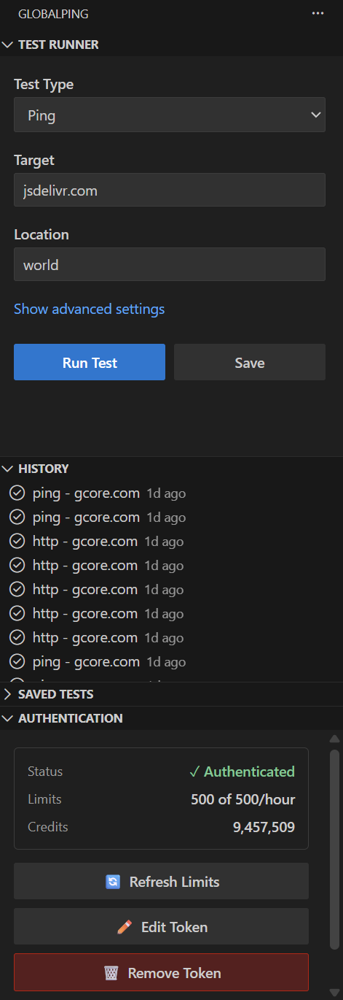
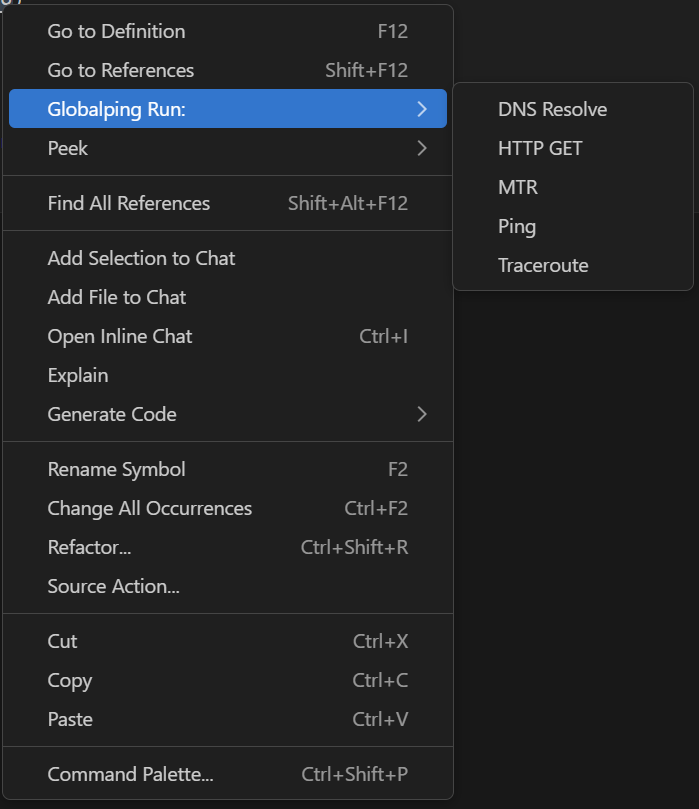
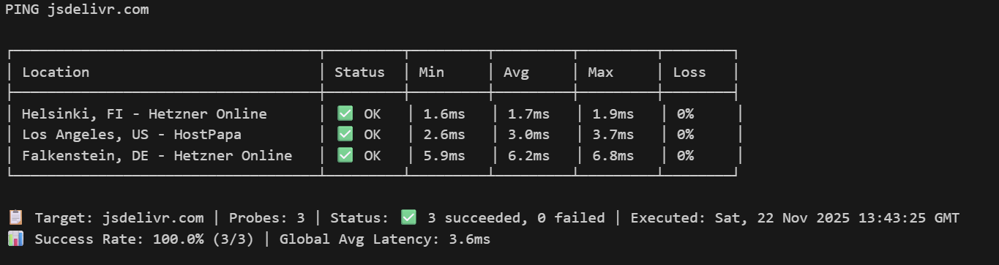
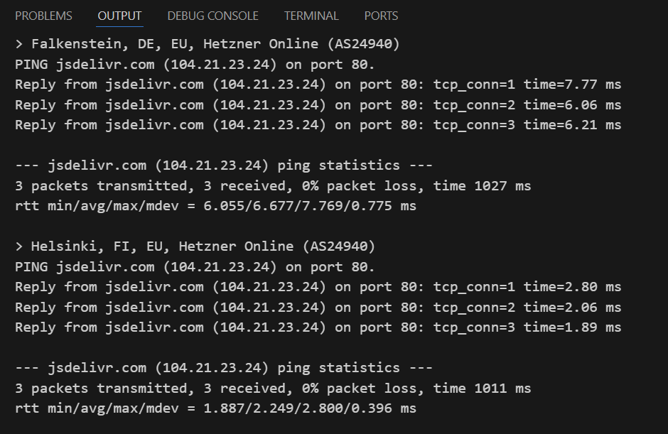

# Globalping VS Code Extension

<div align="center">


**Run network tests from 3000+ locations worldwide, right from your editor**

</div>

---

## Install now

### - [VS Code Marketplace](https://marketplace.visualstudio.com/items?itemName=globalping.globalping)

### - [Open VSX](https://open-vsx.org/extension/globalping/globalping)

## What is Globalping?

Globalping for VS Code brings the power of global network testing directly into your development workflow. Test your APIs, websites, and services from **over 3000 locations worldwide** without leaving your editor.

Perfect for:
- 🔍 **Debugging**: "Is it down for everyone or just me?"
- 🌐 **Multi-region testing**: Verify your service works globally
- ⚡ **Performance testing**: Check latency from different continents
- 🚀 **Post-deployment validation**: Quick smoke tests after deploying

---

## Features

### 🎯 Multiple Test Types
- **Ping** - Check connectivity and latency
- **HTTP/HTTPS** - Test APIs and websites. GET and HEAD support.
- **DNS** - Verify DNS resolution
- **Traceroute** - Run traceroute to check for routing issues
- **MTR** - Combined ping and traceroute

### 🌎 Global Probe Network
- Test from **3000+ locations** worldwide
- Choose any location and specify a country, continent, city, or cloud provider
- Or use "world" for automatic diverse selection

### 🚀 Developer-Friendly
- **Right-click testing** - Select any URL/IP and test it
- **Command Palette** - Keyboard-first workflow
- **Test history** - Review and re-run past tests
- **Saved targets** - One-click testing for frequent endpoints
- **Beautiful results** - Formatted, readable output

### 🔐 Works With or Without Authentication
- **Free tier**: Start immediately, no signup required
- **Authenticated**: Higher limits with a free API token

---

## 📸 Screenshots

### Test from Global Locations


### Right-Click Any URL


### Formatted Results


### Raw Results



---

## 🚀 Getting Started

### Installation

1. Open VS Code
2. Go to Extensions (Ctrl+Shift+X / Cmd+Shift+X)
3. Search for "Globalping"
4. Click Install

### Quick Start

#### Method 1: Right-Click Testing (Easiest!)
1. Highlight any URL, domain, or IP in your code
2. Right-click → **Globalping: Test**
3. Choose test type (Ping, HTTP, DNS, etc.)
4. Results appear in seconds!

#### Method 2: Command Palette
1. Press `Ctrl+Shift+P` (or `Cmd+Shift+P` on Mac)
2. Type: **Globalping: Run New Test**
3. Follow the prompts:
   - Select test type
   - Enter target
   - Choose location
   - Set probe count
4. View results!

#### Method 3: Sidebar Panel
1. Click the Globalping icon in the Activity Bar
2. Fill in the test form
3. Click "Run Test"

---

## 📖 Usage Guide

### Testing Examples

#### Example 1: Check if Your API is Up
```javascript
// In your code file
const API_URL = 'https://api.myapp.com/health';

// 1. Highlight the URL
// 2. Right-click → Globalping: Test → Run HTTP Test
// 3. See results from multiple locations instantly!
```

#### Example 2: Verify DNS Propagation
```
# After deploying new DNS records
mydomain.com

# 1. Highlight the domain
# 2. Right-click → Globalping: Test → Run DNS Lookup
# 3. See which regions have the new records
```

#### Example 3: Check Latency from Asia
```
Command Palette:
1. Globalping: Run New Test
2. Type: ping
3. Target: mycdn.com
4. Location: continent:AS (Asia)
5. Probes: 5
```

### Location Formats

You can test from anywhere:

| Format | Example | Description |
|--------|---------|-------------|
| World | `world` | Auto-select diverse locations |
| Continent | `Europe` | Europe only |
| Country | `US`, `GB`, `JP` | Specific country |
| City | `London`, `Tokyo` | Specific city |
| Cloud Provider | `aws-us-east-1` | Specific cloud region |
| Multiple | `US,GB,DE` | Combined locations |
| Filtered | `Amazon+Germany` | Only probes in Germany hosted with Amazon |

---

## 🔑 Authentication (Optional)

### Free Tier (No Setup)
The extension works immediately with **no authentication required**. You get free credits to start testing right away.

### Authenticated Mode (Recommended)
Get **higher rate limits** with a free API token:

1. **Get a token**:
   - Visit: https://dash.globalping.io/
   - Sign up for free
   - Copy your API token

2. **Add to VS Code** (choose one method):

   **Method 1: Authentication Panel (Recommended)**
   - Open the Globalping sidebar
   - Click on the **Authentication** panel
   - Click **Add API Token**
   - Paste your token ✅
   - View your rate limits and authentication status

   **Method 2: Command Palette**
   - Press `Ctrl+Shift+P`
   - Run: **Globalping: Set API Token**
   - Paste your token ✅

The Authentication panel provides a convenient UI to view your authentication status, check rate limits, and manage your API token.

## ⚙️ Extension Settings

Open Settings (Ctrl+,) and search for "Globalping":

| Setting | Default | Description |
|---------|---------|-------------|
| `globalping.defaultLocation` | `world` | Default test location |
| `globalping.defaultLimit` | `3` | Default number of probes |
| `globalping.inProgressUpdates` | `true` | Show progress during tests |
| `globalping.autoOpenResults` | `true` | Auto-open results tab |


---


## 🔒 Security & Privacy

- ✅ **Secure token storage**: API tokens encrypted by VS Code
- ✅ **HTTPS only**: All API communication is encrypted
- ✅ **Local storage**: History stored locally on your machine

---

## 🐛 Troubleshooting

### "Rate limit exceeded"
**Solution**: Add a free API token via `Globalping: Set API Token`

### Results not showing
**Try**: Check if `autoOpenResults` is enabled in settings

### Extension not activating
**Fix**: Reload window (`Ctrl+Shift+P` → "Reload Window")

---


## 📚 Learn More

- **Globalping Platform**: https://globalping.io
- **Documentation**: https://github.com/jsdelivr/globalping
- **Get API Token**: https://dash.globalping.io/
- **Issues**: https://github.com/jsdelivr/globalping-vscode/issues

---


## 📄 License

MIT License - see [LICENSE.md](LICENSE.md)
